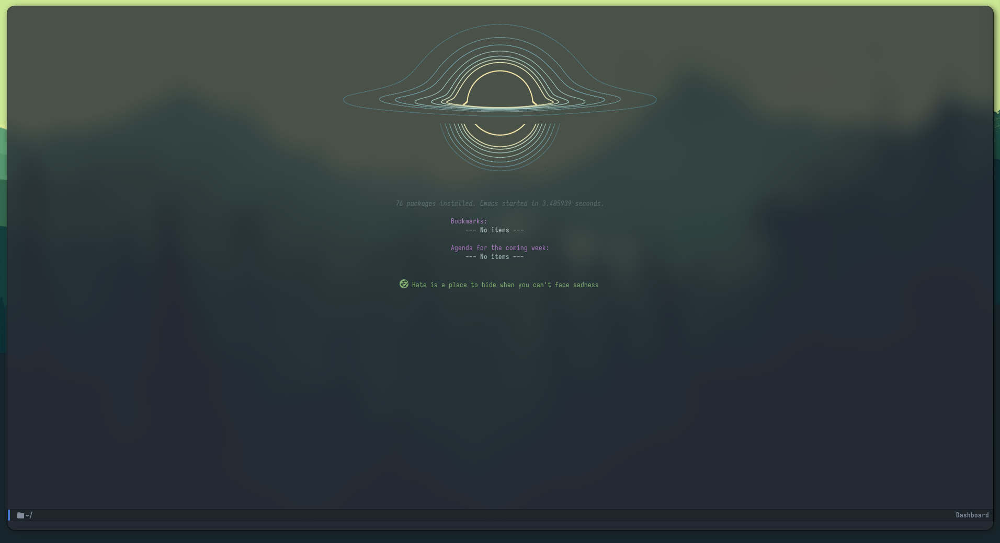
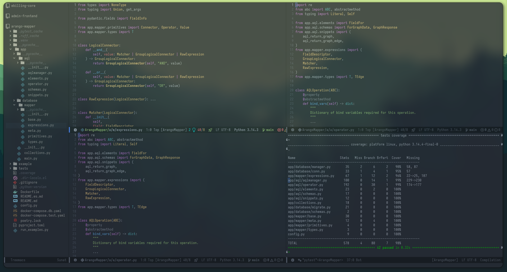

# Custom Power Emacs Config

Una configuración de **Emacs modular**, minimalista y optimizada para el desarrollo de software moderno, centrada en la eficiencia mediante el uso intensivo del teclado.

## Características Principales

- **Arquitectura Modular:** Configuración segmentada en archivos independientes dentro de la carpeta `own/` para un mantenimiento sencillo.
- **Gestión de Paquetes con `straight.el`:** Instalaciones reproducibles y deterministas.
- **IDE Ready:** Soporte completo de **LSP** y **Tree-sitter** para un análisis de código inteligente y resaltado de sintaxis superior.
- **Flujo de Trabajo Keyboard-Driven:** Uso de teclas líder (`M-m`, `M-n`, `M-b`) para evitar combinaciones complejas.
- **Estética Minimalista:** Basada en el tema `Atom One Dark`, fuente `Iosevka` y sin barras de herramientas ruidosas.

## Showcase

*Navegación con Treemacs, dashboard personalizado y línea de modo minimalista.*

## Lenguajes Soportados

| Lenguaje | Herramientas Integradas |
| :--- | :--- |
| **Python** | Pyright (LSP), Pytest, Ruff (Formatting), Pyvenv |
| **JS/TS/TSX** | Typescript-ts-mode, Prettier, npm-bin integration |
| **Lua** | Lua-mode (ideal para configs de AwesomeWM) |
| **Config** | YAML-mode, Magit (Git client) |

## Atajos de Teclado (Keybindings)

Esta configuración utiliza prefijos mnemotécnicos para agrupar funcionalidades:

- `M-m` (Prefijo Principal): Búsqueda de archivos, buffers y comandos globales.
- `M-n` (Lenguajes): Acciones específicas de programación y testing (Pytest).
- `M-b` (Comunes): Control de bloques de código (folding) y edición.
- `M-0` hasta `M-9`: Navegación rápida entre ventanas y el explorador de archivos.
